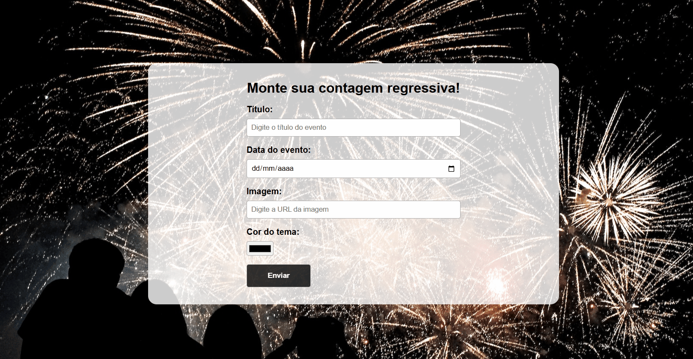

<div align="center">
  
  
  
  
</div>

<br>

<h1 align="center">⏳ Countdown React</h1>

### 🧭 Navegação Rápida

- 📝 [Sobre](#-sobre)
- ✅ [Funcionalidades](#-funcionalidades)
- 🚀 [Screen e Deploy](#-screen-e-deploy)
- 🧩 [Principais Dependências](#-principais-dependências)
- ▶️ [Como Configurar o Projeto no VS Code](#️-como-configurar-o-projeto-no-vs-code)
- 🤝 [Contribuição](#-contribuição)

---

### 📝 Sobre

Projeto desenvolvido durante o curso **Formação Front-end - HTML, CSS, JavaScript, React e +**, da Comunidade Hora de Codar. Construído em **React.js**, simula uma aplicação de contagem regressiva para eventos. Inclui rotas para visualização da home e da contagem, utilizando contexto global para gerenciamento de estado e hooks personalizados.

O objetivo principal é praticar o uso do **React Router**, **Context API**, **React Hooks** e a manipulação de tempo no Front-end.

---

### ✅ Funcionalidades

Com essa aplicação é possível:

- 🕐 **Definir um evento futuro com data e hora**
- ⏳ **Exibir uma contagem regressiva em tempo real**
- 🎨 **Escolher a cor do tema da interface**
- 🖼️ **Inserir imagem de fundo via URL personalizada**
- 🔁 **Redirecionamento entre páginas com React Router**

---

### 🚀 Screen e Deploy

<div align="center">

  <p>
   
  </p>

  <a href="https://cowntdown-livid.vercel.app/">→ Ver Projeto Online 🔗</a>
</div>


---

### 🧩 Principais Dependências

- **[React](https://reactjs.org/)** – Framework para construção da interface
- **[React Router DOM](https://reactrouter.com/)** – Para navegação entre páginas

Para a lista completa de dependências e versões, consulte o arquivo [`package.json`](./package.json).

---

## ▶️ Como Configurar o Projeto no VS Code:

### 📌 Pré-requisitos
Antes de prosseguir com a configuração, certifique-se de ter todos os pré-requisitos instalados corretamente para evitar erros durante a instalação e execução do projeto:

`Git 2.4+` `Node.js 12+` `Live Server` 


### ⚙️ Configurando o Projeto

1. Clone este repositório:
Abra o **VS Code**, pressione `Ctrl + Shift + P`, digite **"Git Clone"** e cole o link do repositório:
```sh
https://github.com/domfabio/Countdown-React.git
```
2. Instalar Dependências:
```sh
npm install
```
3. Inicie o servidor de desenvolvimento:
```sh
npm run dev
```
4. Acesse o projeto no navegador:<br>
No terminal, pressione `Ctrl + Clique` no link gerado:<br>
 ➜  Local:   http://localhost:5173/

---

## 🤝 Contribuição
**Se deseja contribuir, siga os passos:**
1. Fork o repositório
2. Crie uma branch: `git checkout -b feature-minha-feature`
3. Faça commit das suas mudanças: `git commit -m 'Minha nova funcionalidade'`
4. Faça push para a branch: `git push origin feature-minha-feature`
5. Abra um Pull Request

---

Este projeto é distribuído sob a [Open Source License - MIT](https://opensource.org/licenses/MIT). <br>Veja a documentação para mais detalhes.